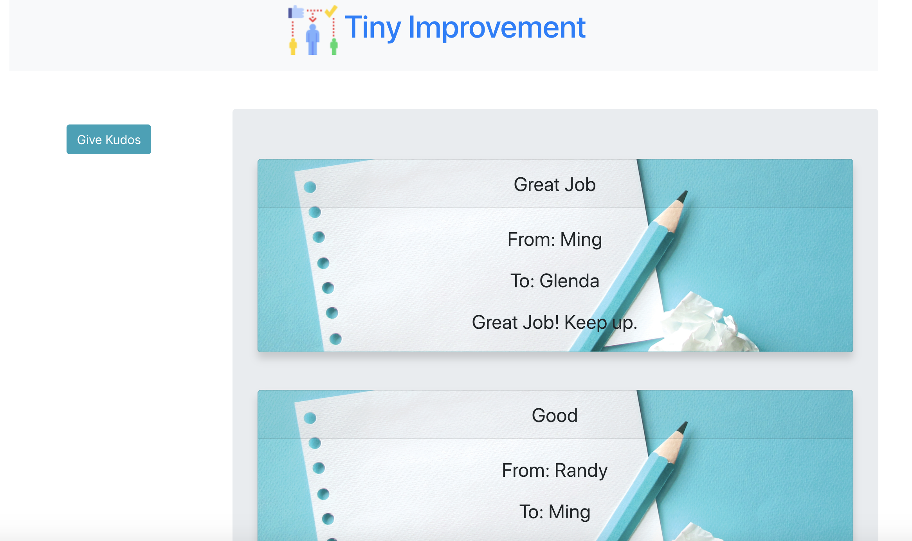
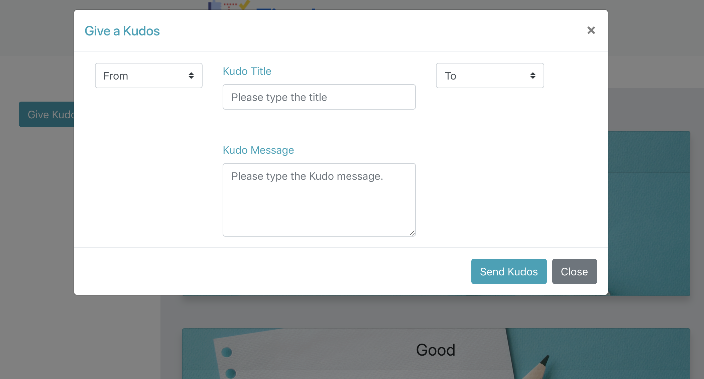
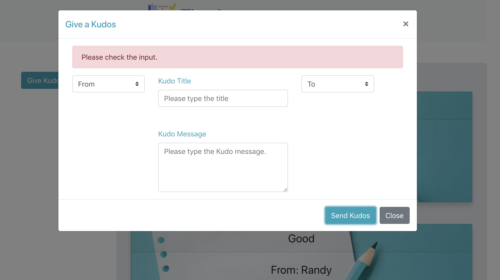

# Tiny-Imporvement-React
---

Description
This is an application called Tiny Improvement that allows users to send compliments or "Kudos" to other users that are then displayed on the page for all to see.

React was used for this program.

***How to use***

1. Go to [Tiny Improvement Site](https://radiant-basin-55923.herokuapp.com/ ). Initially all kudos in the Database will be displayed.

2. Click on  Give Kudos button. This will pop up a window.

3. Select the sender, receiver, and all other information and click on Send Kudo Screen. If there is a missing information, then the message will be displayed.

4. After submitting the kudos, it goes back to the original page.

## Author
___

Makiko Vaughan(makiko.vaughan@gmail.com)